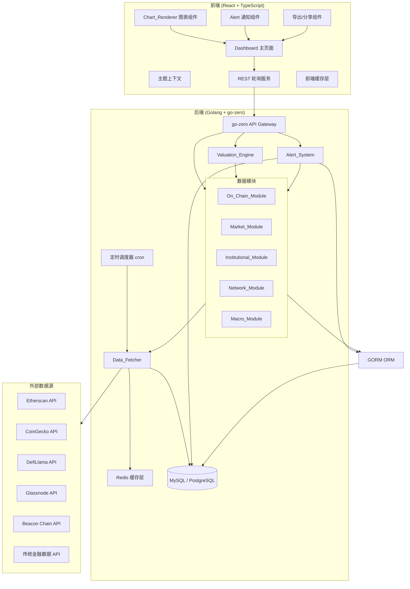

# Design Document: ETH 估值分析仪表板

## Overview

ETH 估值分析仪表板是一个基于 Web 的全面以太坊估值分析工具。系统采用前后端分离架构，前端使用 React + TypeScript 构建交互式仪表板，后端使用 **Golang + go-zero 微服务框架 + GORM ORM** 提供 API 服务和数据聚合。系统整合链上数据、市场数据、机构持仓、网络健康和宏观经济五大维度的数据，聚焦宏观层面的关键指标，通过估值引擎计算综合评分，并提供预警通知、数据导出等功能。

### 关键设计决策

1. **前后端分离**: 前端 React SPA + 后端 Golang REST API，便于独立部署和扩展
2. **Golang 后端**: 使用 go-zero 微服务框架提供高性能 API 服务，GORM 作为 ORM 框架管理数据持久化
3. **REST API 轮询**: 前端通过定时轮询 REST API 获取数据更新，移除 WebSocket 实时推送，降低系统复杂度
4. **多层缓存策略**: 后端 Redis 缓存 + 前端内存缓存，按数据类型设置不同 TTL
5. **模块化数据获取**: 每个数据维度独立模块，支持独立刷新和故障隔离
6. **聚焦宏观数据**: 关注各维度的核心宏观指标，避免过于细粒度的数据展示

## Architecture

### 系统架构图



### 分层架构

系统采用四层架构：

1. **展示层 (Presentation Layer)**: React 组件、图表渲染、主题管理、REST 轮询
2. **API 层 (API Layer)**: go-zero API 路由定义、中间件、请求/响应结构体
3. **业务逻辑层 (Business Logic Layer)**: 数据模块、估值引擎、预警系统
4. **数据访问层 (Data Access Layer)**: GORM 模型、数据获取器、Redis 缓存、外部 API 适配器

### go-zero 项目结构

```
eth-valuation-api/
├── etc/
│   └── config.yaml              # go-zero 配置文件
├── internal/
│   ├── config/
│   │   └── config.go            # 配置结构体
│   ├── handler/                  # HTTP Handler（由 goctl 生成）
│   ├── logic/                    # 业务逻辑层
│   │   ├── onchain/
│   │   ├── market/
│   │   ├── institutional/
│   │   ├── network/
│   │   ├── macro/
│   │   ├── valuation/
│   │   └── alert/
│   ├── model/                    # GORM 数据模型
│   ├── svc/
│   │   └── servicecontext.go    # 服务上下文（依赖注入）
│   ├── types/
│   │   └── types.go             # 请求/响应类型
│   ├── middleware/
│   └── fetcher/                  # 外部数据获取器
├── api/
│   └── valuation.api            # go-zero API 定义文件
└── main.go
```


## Components and Interfaces

### 1. Data_Fetcher (数据获取服务)

负责从外部 API 获取原始数据，处理重试、缓存和错误恢复。

```go
// fetcher/fetcher.go

type DataFetcherConfig struct {
    MaxRetries     int           `json:"maxRetries"`     // 最大重试次数，默认 3
    RetryDelay     time.Duration `json:"retryDelay"`     // 重试间隔
    RequestTimeout time.Duration `json:"requestTimeout"` // 请求超时时间
}

type FetchResult[T any] struct {
    Data      T      `json:"data"`
    Source    string `json:"source"`    // "live" | "cache"
    Timestamp int64  `json:"timestamp"` // Unix 时间戳
    Error     string `json:"error,omitempty"`
}

type DataFetcher interface {
    // 获取数据，优先从缓存读取，缓存过期则从 API 获取
    Fetch(ctx context.Context, key string, ttl time.Duration, fetcher func() (interface{}, error)) (*FetchResult[interface{}], error)

    // 强制刷新，跳过缓存
    ForceFetch(ctx context.Context, key string, ttl time.Duration, fetcher func() (interface{}, error)) (*FetchResult[interface{}], error)

    // 使指定 key 的缓存失效
    InvalidateCache(ctx context.Context, key string) error

    // 批量获取
    FetchBatch(ctx context.Context, requests []FetchRequest) ([]*FetchResult[interface{}], error)
}

type FetchRequest struct {
    Key     string
    TTL     time.Duration
    Fetcher func() (interface{}, error)
}
```

### 2. On_Chain_Module (链上数据模块)

```go
// types/onchain.go

type BurnData struct {
    Daily              float64           `json:"daily"`              // 24h 销毁量 (ETH)
    Weekly             float64           `json:"weekly"`             // 7d 销毁量
    Monthly            float64           `json:"monthly"`            // 30d 销毁量
    Cumulative         float64           `json:"cumulative"`         // 自 EIP-1559 以来累计销毁量
    AnnualizedBurnRate float64           `json:"annualizedBurnRate"` // 年化销毁率 (%)
    DailyHistory       []TimeSeriesPoint `json:"dailyHistory"`       // 每日销毁历史
}

type GasData struct {
    CurrentAvgGwei     float64           `json:"currentAvgGwei"`
    CurrentAvgUsd      float64           `json:"currentAvgUsd"`
    DailyFeeRevenueEth float64           `json:"dailyFeeRevenueEth"`
    DailyFeeRevenueUsd float64           `json:"dailyFeeRevenueUsd"`
    PriorityFeeShare   float64           `json:"priorityFeeShare"`   // 验证者小费占比 (%)
    BaseFeeShare       float64           `json:"baseFeeShare"`       // Base Fee 销毁占比 (%)
    AnnualizedRevenue  float64           `json:"annualizedRevenue"`  // 年化费用收入 (USD)
    PriceToFeeRatio    float64           `json:"priceToFeeRatio"`    // 市费率
    GasHistory         []TimeSeriesPoint `json:"gasHistory"`
    IsHighFee          bool              `json:"isHighFee"`          // Gas > 50 Gwei
}

type ActivityData struct {
    DailyActiveAddresses int64             `json:"dailyActiveAddresses"`
    DAAMovingAvg7d       float64           `json:"daaMovingAvg7d"`
    DailyTransactions    int64             `json:"dailyTransactions"`
    DailyNewAddresses    int64             `json:"dailyNewAddresses"`
    NVTRatio             float64           `json:"nvtRatio"`
    NVTHistoricalMedian  float64           `json:"nvtHistoricalMedian"`
    NVTPercentile        float64           `json:"nvtPercentile"`
    NVTSignal            string            `json:"nvtSignal"` // "overvalued" | "undervalued" | "neutral"
    L2Comparison         []L2TransactionData `json:"l2Comparison"`
    TransactionHistory   []TimeSeriesPoint `json:"transactionHistory"`
}

type L2TransactionData struct {
    Network           string `json:"network"` // "Arbitrum" | "Optimism" | "Base" | "zkSync"
    DailyTransactions int64  `json:"dailyTransactions"`
}

type TVLData struct {
    TotalTVLUsd        float64           `json:"totalTvlUsd"`
    TotalTVLEth        float64           `json:"totalTvlEth"`
    TVLToMarketCapRatio float64          `json:"tvlToMarketCapRatio"`
    ETHTVLDominance    float64           `json:"ethTvlDominance"`
    TopProtocols       []ProtocolTVL     `json:"topProtocols"`
    TVLHistory         []TimeSeriesPoint `json:"tvlHistory"`
    DominanceHistory   []TimeSeriesPoint `json:"dominanceHistory"`
}

type ProtocolTVL struct {
    Name    string  `json:"name"`
    TVLUsd  float64 `json:"tvlUsd"`
    Share   float64 `json:"share"` // 占比 (%)
}

type SupplyData struct {
    TotalSupply          float64           `json:"totalSupply"`
    StakedAmount         float64           `json:"stakedAmount"`
    DeFiLocked           float64           `json:"defiLocked"`
    ExchangeBalance      float64           `json:"exchangeBalance"`
    OtherAmount          float64           `json:"otherAmount"`
    NetIssuance          float64           `json:"netIssuance"`
    IsDeflationary       bool              `json:"isDeflationary"`
    AnnualInflationRate  float64           `json:"annualInflationRate"`
    SupplyHistory        []TimeSeriesPoint `json:"supplyHistory"`
    ExchangeBalanceHistory []TimeSeriesPoint `json:"exchangeBalanceHistory"`
}
```

### 3. Market_Module (市场数据模块)

```go
// types/market.go

type MarketData struct {
    CurrentPrice          float64          `json:"currentPrice"`
    PriceChange24h        float64          `json:"priceChange24h"`        // 24h 涨跌幅 (%)
    Volume24h             float64          `json:"volume24h"`
    Volume7d              float64          `json:"volume7d"`
    CirculatingMarketCap  float64          `json:"circulatingMarketCap"`
    FullyDilutedMarketCap float64          `json:"fullyDilutedMarketCap"`
    MarketCapRank         int              `json:"marketCapRank"`
    ATHPrice              float64          `json:"athPrice"`
    ATHDrawdown           float64          `json:"athDrawdown"`           // 距 ATH 回撤百分比 (%)
    ExchangePrices        []ExchangePrice  `json:"exchangePrices"`
}

type ExchangePrice struct {
    Exchange string  `json:"exchange"` // "Binance" | "Coinbase" | "OKX"
    Price    float64 `json:"price"`
    Spread   float64 `json:"spread"`  // 与均价的差异 (%)
}

type OHLCVPoint struct {
    Timestamp int64   `json:"timestamp"`
    Open      float64 `json:"open"`
    High      float64 `json:"high"`
    Low       float64 `json:"low"`
    Close     float64 `json:"close"`
    Volume    float64 `json:"volume"`
}

// TimeRange 时间范围枚举
type TimeRange string

const (
    TimeRange1D  TimeRange = "1d"
    TimeRange1W  TimeRange = "1w"
    TimeRange1M  TimeRange = "1m"
    TimeRange3M  TimeRange = "3m"
    TimeRange1Y  TimeRange = "1y"
    TimeRangeAll TimeRange = "all"
)
```

### 4. Valuation_Engine (估值引擎)

```go
// types/valuation.go

type ValuationScore struct {
    Overall   float64            `json:"overall"`   // 综合评分 0-100
    Status    string             `json:"status"`    // "undervalued" | "fair" | "overvalued"
    Breakdown ValuationBreakdown `json:"breakdown"`
    RadarData []RadarDataPoint   `json:"radarData"`
}

type ValuationBreakdown struct {
    MVRVScore        MVRVResult        `json:"mvrvScore"`
    PriceToFeeScore  PriceToFeeResult  `json:"priceToFeeScore"`
    DCFValuation     DCFResult         `json:"dcfValuation"`
    StockToFlowScore StockToFlowResult `json:"stockToFlowScore"`
    NVTScore         NVTResult         `json:"nvtScore"`
    ETHBTCScore      ETHBTCResult      `json:"ethBtcScore"`
}

type MVRVResult struct {
    Ratio               float64           `json:"ratio"`
    HistoricalPercentile float64          `json:"historicalPercentile"`
    Signal              string            `json:"signal"` // "overvalued" | "undervalued" | "neutral"
    History             []TimeSeriesPoint `json:"history"`
}

type PriceToFeeResult struct {
    Ratio               float64 `json:"ratio"`
    HistoricalPercentile float64 `json:"historicalPercentile"`
    Signal              string  `json:"signal"`
}

type DCFResult struct {
    FairValueLow  float64        `json:"fairValueLow"`
    FairValueMid  float64        `json:"fairValueMid"`
    FairValueHigh float64        `json:"fairValueHigh"`
    Assumptions   DCFAssumptions `json:"assumptions"`
}

type DCFAssumptions struct {
    DiscountRate       float64 `json:"discountRate"`
    GrowthRate         float64 `json:"growthRate"`
    TerminalGrowthRate float64 `json:"terminalGrowthRate"`
    ProjectionYears    int     `json:"projectionYears"`
}

type StockToFlowResult struct {
    Ratio      float64 `json:"ratio"`
    ModelPrice float64 `json:"modelPrice"`
    Deviation  float64 `json:"deviation"` // 当前价格与模型价格的偏差 (%)
}

type NVTResult struct {
    Ratio               float64 `json:"ratio"`
    HistoricalPercentile float64 `json:"historicalPercentile"`
    Signal              string  `json:"signal"`
}

type ETHBTCResult struct {
    Ratio               float64 `json:"ratio"`
    HistoricalPercentile float64 `json:"historicalPercentile"`
    Signal              string  `json:"signal"`
}

type RadarDataPoint struct {
    Dimension string  `json:"dimension"`
    Score     float64 `json:"score"` // 0-100
    Label     string  `json:"label"`
}

type DistributionData struct {
    Values            []float64          `json:"values"`
    Percentiles       map[int]float64    `json:"percentiles"` // percentile -> value
    CurrentValue      float64            `json:"currentValue"`
    CurrentPercentile float64            `json:"currentPercentile"`
}
```

### 5. Institutional_Module (机构数据模块)

```go
// types/institutional.go

type ETFData struct {
    ETFs                    []ETFHolding      `json:"etfs"`
    TotalHoldingsETH        float64           `json:"totalHoldingsEth"`
    TotalHoldingsUSD        float64           `json:"totalHoldingsUsd"`
    HoldingsPercentOfSupply float64           `json:"holdingsPercentOfSupply"`
    CumulativeNetFlow       float64           `json:"cumulativeNetFlow"`
    NetFlowHistory          []TimeSeriesPoint `json:"netFlowHistory"`
}

type ETFHolding struct {
    Issuer          string            `json:"issuer"`
    Ticker          string            `json:"ticker"`
    HoldingsETH     float64           `json:"holdingsEth"`
    HoldingsUSD     float64           `json:"holdingsUsd"`
    DailyNetFlowUSD float64           `json:"dailyNetFlowUsd"`
    MarketShare     float64           `json:"marketShare"`
    FlowHistory     []TimeSeriesPoint `json:"flowHistory"`
}

type GrayscaleData struct {
    HoldingsETH     float64           `json:"holdingsEth"`
    NAV             float64           `json:"nav"`
    PremiumDiscount float64           `json:"premiumDiscount"` // 溢价/折价率 (%)
    PremiumHistory  []TimeSeriesPoint `json:"premiumHistory"`
}

type InstitutionalHoldings struct {
    Institutions      []InstitutionEntry `json:"institutions"`
    CMEFuturesOI      float64            `json:"cmeFuturesOI"`
    CMEFuturesHistory []TimeSeriesPoint  `json:"cmeFuturesHistory"`
}

type InstitutionEntry struct {
    Name        string  `json:"name"`
    HoldingsETH float64 `json:"holdingsEth"`
    HoldingsUSD float64 `json:"holdingsUsd"`
}
```

### 6. Network_Module (网络健康模块)

```go
// types/network.go

type StakingData struct {
    TotalStakedETH     float64              `json:"totalStakedEth"`
    StakingPercentage  float64              `json:"stakingPercentage"`
    ActiveValidators   int64                `json:"activeValidators"`
    StakingYield       float64              `json:"stakingYield"`
    EntryQueueLength   int64                `json:"entryQueueLength"`
    ExitQueueLength    int64                `json:"exitQueueLength"`
    EntryWaitTime      string               `json:"entryWaitTime"`
    ExitWaitTime       string               `json:"exitWaitTime"`
    LiquidStakingShares []LiquidStakingShare `json:"liquidStakingShares"`
    ValidatorHistory   []TimeSeriesPoint    `json:"validatorHistory"`
    YieldHistory       []TimeSeriesPoint    `json:"yieldHistory"`
}

type LiquidStakingShare struct {
    Protocol  string  `json:"protocol"` // "Lido" | "Rocket Pool" | "Coinbase"
    Share     float64 `json:"share"`
    StakedETH float64 `json:"stakedEth"`
}

type NetworkPerformance struct {
    AvgBlockTime      float64       `json:"avgBlockTime"`
    BlockUtilization  float64       `json:"blockUtilization"`
    CurrentTPS        float64       `json:"currentTps"`
    MaxTPS            float64       `json:"maxTps"`
    TPSRatio          float64       `json:"tpsRatio"`
    MissedSlots24h    int64         `json:"missedSlots24h"`
    MissedSlotsRate   float64       `json:"missedSlotsRate"`
    AttestationRate   float64       `json:"attestationRate"`
    ClientDiversity   []ClientShare `json:"clientDiversity"`
}

type ClientShare struct {
    Client string  `json:"client"` // "Geth" | "Prysm" | "Lighthouse" ...
    Share  float64 `json:"share"`
}
```

### 7. Macro_Module (宏观经济模块)

```go
// types/macro.go

type ETHBTCData struct {
    ETHBTCPrice        float64           `json:"ethBtcPrice"`
    ETHBTCHistory      []TimeSeriesPoint `json:"ethBtcHistory"`
    Correlation30d     float64           `json:"correlation30d"`
    Correlation90d     float64           `json:"correlation90d"`
    ETHDominance       float64           `json:"ethDominance"`
    ETHDominanceHistory []TimeSeriesPoint `json:"ethDominanceHistory"`
    ETHBTCPercentile   float64           `json:"ethBtcPercentile"`
    ETHBTCSignal       string            `json:"ethBtcSignal"` // "eth_undervalued" | "eth_overvalued" | "neutral"
}

type MacroIndicators struct {
    DXYIndex              float64           `json:"dxyIndex"`
    DXYHistory            []TimeSeriesPoint `json:"dxyHistory"`
    Treasury10Y           float64           `json:"treasury10y"`
    Treasury10YHistory    []TimeSeriesPoint `json:"treasury10yHistory"`
    NasdaqCorrelation30d  float64           `json:"nasdaqCorrelation30d"`
    NasdaqCorrelation90d  float64           `json:"nasdaqCorrelation90d"`
    FedFundsRate          float64           `json:"fedFundsRate"`
    RateExpectations      []RateExpectation `json:"rateExpectations"`
    FearGreedIndex        int               `json:"fearGreedIndex"`
    FearGreedHistory      []TimeSeriesPoint `json:"fearGreedHistory"`
    StablecoinMarketCap   float64           `json:"stablecoinMarketCap"`
    StablecoinHistory     []TimeSeriesPoint `json:"stablecoinHistory"`
}

type RateExpectation struct {
    Date         string  `json:"date"`
    ExpectedRate float64 `json:"expectedRate"`
    Probability  float64 `json:"probability"`
}
```

### 8. Alert_System (预警系统)

```go
// types/alert.go

type AlertRule struct {
    ID        string         `json:"id"`
    MetricKey string         `json:"metricKey"`
    Condition AlertCondition `json:"condition"`
    Threshold float64        `json:"threshold"`
    Severity  string         `json:"severity"` // "high" | "medium" | "low"
    Enabled   bool           `json:"enabled"`
    Message   string         `json:"message"`
}

type AlertCondition struct {
    Type                string  `json:"type"` // "gt" | "lt" | "gt_percent_change" | "lt_percent_change"
    ReferenceValue      float64 `json:"referenceValue,omitempty"`
    ReferencePeriodDays int     `json:"referencePeriodDays,omitempty"`
}

type Alert struct {
    ID             string  `json:"id"`
    RuleID         string  `json:"ruleId"`
    TriggeredAt    int64   `json:"triggeredAt"`
    Severity       string  `json:"severity"`
    Title          string  `json:"title"`
    Message        string  `json:"message"`
    MetricKey      string  `json:"metricKey"`
    CurrentValue   float64 `json:"currentValue"`
    ThresholdValue float64 `json:"thresholdValue"`
    Acknowledged   bool    `json:"acknowledged"`
}

// AlertService 预警服务接口
type AlertService interface {
    // 评估所有预警规则
    EvaluateAlerts(metrics map[string]float64) []Alert

    // 管理预警规则
    AddRule(rule AlertRule) error
    UpdateRule(ruleID string, updates AlertRule) error
    RemoveRule(ruleID string) error
    ToggleRule(ruleID string, enabled bool) error

    // 查询预警
    GetActiveAlerts() ([]Alert, error)
    GetAlertHistory(days int) ([]Alert, error)
    AcknowledgeAlert(alertID string) error

    // 排序
    SortAlertsBySeverity(alerts []Alert) []Alert
}
```

### 9. 前端组件（React + TypeScript）

前端保持 React + TypeScript 技术栈，通过 REST API 轮询获取数据。

```typescript
// 前端 REST 轮询服务
interface PollingConfig {
  priceInterval: number;       // 价格数据轮询间隔: 10 秒
  onChainInterval: number;     // 链上数据轮询间隔: 5 分钟
  institutionalInterval: number; // 机构数据轮询间隔: 1 小时
}

// 全局状态 (使用 Zustand)
interface DashboardStore {
  // 数据状态
  onChainData: OnChainState;
  marketData: MarketData | null;
  institutionalData: InstitutionalState;
  networkData: NetworkState;
  macroData: MacroState;
  valuationScore: ValuationScore | null;

  // UI 状态
  theme: 'light' | 'dark';
  activeAlerts: Alert[];
  isLoading: Record<string, boolean>;
  lastUpdated: Record<string, number>;
  errors: Record<string, string>;

  // 操作
  refreshAll(): Promise<void>;
  refreshModule(module: string): Promise<void>;
  toggleTheme(): void;
  setAlertRule(rule: AlertRule): void;
}

// 图表渲染器
interface ChartConfig {
  type: 'line' | 'area' | 'stackedArea' | 'bar' | 'candlestick' | 'pie' | 'radar';
  title: string;
  data: ChartDataset[];
  xAxis?: AxisConfig;
  yAxis?: AxisConfig;
  legend?: boolean;
  tooltip?: boolean;
  responsive?: boolean;
}

interface ExportOptions {
  format: 'png' | 'svg';
  width?: number;
  height?: number;
  filename?: string;
}
```

### 共享类型

```go
// types/common.go

type TimeSeriesPoint struct {
    Timestamp int64   `json:"timestamp"`
    Value     float64 `json:"value"`
}

type APIResponse[T any] struct {
    Code    int    `json:"code"`
    Message string `json:"message"`
    Data    T      `json:"data"`
    Meta    Meta   `json:"meta"`
}

type Meta struct {
    LastUpdated int64  `json:"lastUpdated"`
    Source      string `json:"source"` // "live" | "cache"
    NextRefresh int64  `json:"nextRefresh"`
}
```


## Data Models

### go-zero API 定义文件

```api
// api/valuation.api

type (
    TimeSeriesPoint {
        Timestamp int64   `json:"timestamp"`
        Value     float64 `json:"value"`
    }

    Meta {
        LastUpdated int64  `json:"lastUpdated"`
        Source      string `json:"source"`
        NextRefresh int64  `json:"nextRefresh"`
    }
)

@server(
    prefix: /api/v1
    middleware: CorsMiddleware
)
service valuation-api {
    @handler GetOverview
    get /overview returns (OverviewResp)

    @handler GetBurnData
    get /onchain/burn returns (BurnDataResp)

    @handler GetGasData
    get /onchain/gas returns (GasDataResp)

    @handler GetActivityData
    get /onchain/activity returns (ActivityDataResp)

    @handler GetTVLData
    get /onchain/tvl returns (TVLDataResp)

    @handler GetSupplyData
    get /onchain/supply returns (SupplyDataResp)

    @handler GetMarketData
    get /market returns (MarketDataResp)

    @handler GetPriceHistory
    get /market/price-history (PriceHistoryReq) returns (PriceHistoryResp)

    @handler GetValuation
    get /valuation returns (ValuationResp)

    @handler GetDCFValuation
    get /valuation/dcf (DCFReq) returns (DCFResp)

    @handler GetDistribution
    get /valuation/distribution/:metric returns (DistributionResp)

    @handler GetETFData
    get /institutional/etf returns (ETFDataResp)

    @handler GetGrayscaleData
    get /institutional/grayscale returns (GrayscaleDataResp)

    @handler GetInstitutionalHoldings
    get /institutional/holdings returns (InstitutionalHoldingsResp)

    @handler GetStakingData
    get /network/staking returns (StakingDataResp)

    @handler GetNetworkPerformance
    get /network/performance returns (NetworkPerformanceResp)

    @handler GetETHBTCData
    get /macro/ethbtc returns (ETHBTCDataResp)

    @handler GetMacroIndicators
    get /macro/indicators returns (MacroIndicatorsResp)

    @handler GetActiveAlerts
    get /alerts returns (AlertsResp)

    @handler GetAlertHistory
    get /alerts/history (AlertHistoryReq) returns (AlertsResp)

    @handler CreateAlertRule
    post /alerts/rules (CreateAlertRuleReq) returns (AlertRuleResp)

    @handler UpdateAlertRule
    put /alerts/rules/:id (UpdateAlertRuleReq) returns (AlertRuleResp)

    @handler DeleteAlertRule
    delete /alerts/rules/:id returns (BaseResp)

    @handler ExportChart
    post /export/chart (ExportChartReq) returns (ExportResp)

    @handler ExportCSV
    post /export/csv (ExportCSVReq) returns (ExportResp)

    @handler GenerateShareLink
    post /share (ShareReq) returns (ShareResp)

    @handler ForceRefresh
    post /refresh returns (BaseResp)
}
```

### API 端点汇总

```
后端 API 路由结构 (REST Only):

GET  /api/v1/overview                      - 仪表板总览数据
GET  /api/v1/onchain/burn                  - EIP-1559 销毁数据
GET  /api/v1/onchain/gas                   - Gas 费用数据
GET  /api/v1/onchain/activity              - 链上活跃度数据
GET  /api/v1/onchain/tvl                   - TVL 数据
GET  /api/v1/onchain/supply                - 供应量数据
GET  /api/v1/market                        - 市场价格与交易数据
GET  /api/v1/market/price-history          - 历史价格 (query: timeRange)
GET  /api/v1/valuation                     - 估值模型综合结果
GET  /api/v1/valuation/dcf                 - DCF 模型 (query: assumptions)
GET  /api/v1/valuation/distribution/:metric - 指标历史分布
GET  /api/v1/institutional/etf             - ETF 数据
GET  /api/v1/institutional/grayscale       - 灰度信托数据
GET  /api/v1/institutional/holdings        - 机构持仓汇总
GET  /api/v1/network/staking               - 质押数据
GET  /api/v1/network/performance           - 网络性能数据
GET  /api/v1/macro/ethbtc                  - ETH/BTC 相关性数据
GET  /api/v1/macro/indicators              - 宏观经济指标
GET  /api/v1/alerts                        - 获取活跃预警
GET  /api/v1/alerts/history                - 预警历史 (query: days)
POST /api/v1/alerts/rules                  - 创建预警规则
PUT  /api/v1/alerts/rules/:id              - 更新预警规则
DELETE /api/v1/alerts/rules/:id            - 删除预警规则
POST /api/v1/export/chart                  - 导出图表
POST /api/v1/export/csv                    - 导出 CSV
POST /api/v1/share                         - 生成分享链接
POST /api/v1/refresh                       - 强制刷新所有数据
```

### 前端轮询策略（替代 WebSocket）

```typescript
// 前端轮询配置
const POLLING_CONFIG = {
  price: 10_000,              // 价格数据: 每 10 秒轮询
  onChainMetrics: 300_000,    // 链上指标: 每 5 分钟轮询
  tvlData: 300_000,           // TVL 数据: 每 5 分钟轮询
  institutionalData: 3_600_000, // 机构数据: 每 1 小时轮询
  networkData: 300_000,       // 网络数据: 每 5 分钟轮询
  macroData: 3_600_000,       // 宏观数据: 每 1 小时轮询
  alerts: 30_000,             // 预警数据: 每 30 秒轮询
} as const;
```

### GORM 数据库模型

```go
// model/alert_rule.go

type AlertRuleModel struct {
    ID                  string    `gorm:"primaryKey;type:varchar(36)" json:"id"`
    MetricKey           string    `gorm:"type:varchar(100);not null;index" json:"metricKey"`
    ConditionType       string    `gorm:"type:varchar(30);not null" json:"conditionType"`
    Threshold           float64   `gorm:"not null" json:"threshold"`
    ReferenceValue      float64   `json:"referenceValue"`
    ReferencePeriodDays int       `json:"referencePeriodDays"`
    Severity            string    `gorm:"type:varchar(10);not null" json:"severity"`
    Enabled             bool      `gorm:"default:true" json:"enabled"`
    CustomMessage       string    `gorm:"type:text" json:"customMessage"`
    CreatedAt           time.Time `gorm:"autoCreateTime" json:"createdAt"`
    UpdatedAt           time.Time `gorm:"autoUpdateTime" json:"updatedAt"`
}

func (AlertRuleModel) TableName() string {
    return "alert_rules"
}

// model/alert_history.go

type AlertHistoryModel struct {
    ID             string    `gorm:"primaryKey;type:varchar(36)" json:"id"`
    RuleID         string    `gorm:"type:varchar(36);index" json:"ruleId"`
    TriggeredAt    time.Time `gorm:"not null;index" json:"triggeredAt"`
    Severity       string    `gorm:"type:varchar(10);not null" json:"severity"`
    Title          string    `gorm:"type:varchar(255);not null" json:"title"`
    Message        string    `gorm:"type:text" json:"message"`
    MetricKey      string    `gorm:"type:varchar(100)" json:"metricKey"`
    CurrentValue   float64   `json:"currentValue"`
    ThresholdValue float64   `json:"thresholdValue"`
    Acknowledged   bool      `gorm:"default:false" json:"acknowledged"`
    AcknowledgedAt *time.Time `json:"acknowledgedAt"`
    CreatedAt      time.Time `gorm:"autoCreateTime" json:"createdAt"`
}

func (AlertHistoryModel) TableName() string {
    return "alert_history"
}

// model/share_link.go

type ShareLinkModel struct {
    ID            string    `gorm:"primaryKey;type:varchar(36)" json:"id"`
    DashboardState string   `gorm:"type:text;not null" json:"dashboardState"` // JSON 序列化
    SnapshotData  string    `gorm:"type:longtext" json:"snapshotData"`        // JSON 序列化
    ExpiresAt     time.Time `gorm:"not null;index" json:"expiresAt"`
    CreatedAt     time.Time `gorm:"autoCreateTime" json:"createdAt"`
}

func (ShareLinkModel) TableName() string {
    return "share_links"
}
```

### 缓存策略配置

```go
// config/cache.go

var CacheTTLConfig = map[string]time.Duration{
    "price":             10 * time.Second,    // 价格数据: 10 秒
    "gasData":           5 * time.Minute,     // Gas 数据: 5 分钟
    "onChainMetrics":    5 * time.Minute,     // 链上指标: 5 分钟
    "tvlData":           5 * time.Minute,     // TVL 数据: 5 分钟
    "institutionalData": 1 * time.Hour,       // 机构数据: 1 小时
    "networkData":       5 * time.Minute,     // 网络数据: 5 分钟
    "macroData":         1 * time.Hour,       // 宏观数据: 1 小时
    "valuationScore":    5 * time.Minute,     // 估值评分: 5 分钟
}
```

### 外部数据源适配器配置

```go
// config/datasource.go

type DataSourceConfig struct {
    Etherscan   EtherscanConfig   `yaml:"etherscan"`
    CoinGecko   CoinGeckoConfig   `yaml:"coingecko"`
    DefiLlama   DefiLlamaConfig   `yaml:"defillama"`
    Glassnode   GlassnodeConfig   `yaml:"glassnode"`
    BeaconChain BeaconChainConfig `yaml:"beaconchain"`
}

type EtherscanConfig struct {
    APIKey  string `yaml:"apiKey"`
    BaseURL string `yaml:"baseUrl"`
}

type CoinGeckoConfig struct {
    APIKey  string `yaml:"apiKey"`
    BaseURL string `yaml:"baseUrl"`
}

type DefiLlamaConfig struct {
    BaseURL string `yaml:"baseUrl"`
}

type GlassnodeConfig struct {
    APIKey  string `yaml:"apiKey"`
    BaseURL string `yaml:"baseUrl"`
}

type BeaconChainConfig struct {
    BaseURL string `yaml:"baseUrl"`
}
```


## Correctness Properties

*A property is a characteristic or behavior that should hold true across all valid executions of a system — essentially, a formal statement about what the system should do. Properties serve as the bridge between human-readable specifications and machine-verifiable correctness guarantees.*

### Property 1: 综合估值评分范围不变量

*For any* set of input metrics provided to the Valuation_Engine, the calculated overall score SHALL always be in the range [0, 100], and the status label SHALL be `"undervalued"` when score < 33, `"fair"` when 33 ≤ score ≤ 66, and `"overvalued"` when score > 66.

**Validates: Requirements 1.3**

### Property 2: 预警规则评估正确性

*For any* metric value, *any* alert rule (with condition type `"gt"`, `"lt"`, `"gt_percent_change"`, or `"lt_percent_change"`), and *any* enabled/disabled state, the `AlertService.EvaluateAlerts` function SHALL trigger an alert if and only if (1) the rule is enabled AND (2) the metric value satisfies the rule's condition against its threshold. Disabled rules SHALL never produce alerts regardless of metric values. This property subsumes all specific alert threshold checks including: burn amount > 200% of 30-day average (Req 2.5), gas > 50 Gwei (Req 3.6), TVL dominance drop > 3pp (Req 5.6), ETF flow > 300% of average (Req 8.5, 8.6), Grayscale discount > 20% (Req 9.5), validator exits > 500 (Req 10.7), missed slots > 5% (Req 11.6), and exchange outflow > 5% (Req 17.5).

**Validates: Requirements 2.5, 3.6, 5.6, 8.5, 8.6, 9.5, 10.7, 11.6, 15.2, 15.4, 17.5**

### Property 3: 预警严重程度排序

*For any* list of Alert objects with mixed severity levels, the `SortAlertsBySeverity` function SHALL return a list where all `"high"` severity alerts appear before all `"medium"` severity alerts, and all `"medium"` severity alerts appear before all `"low"` severity alerts. The relative order of alerts within the same severity level SHALL be preserved (stable sort).

**Validates: Requirements 15.5**

### Property 4: 份额/占比计算求和不变量

*For any* set of non-negative component values (e.g., protocol TVL shares, ETF market shares, liquid staking shares, client diversity shares, supply distribution categories), the calculated percentage shares SHALL sum to 100% (within floating-point tolerance of ±0.01%), and each individual share SHALL equal `(componentValue / totalValue) × 100`.

**Validates: Requirements 3.4, 5.3, 8.7, 10.5, 11.5, 17.2**

### Property 5: 比率与百分比计算正确性

*For any* valid numerator and positive denominator, ratio calculations SHALL produce the correct result: `ratio = numerator / denominator`. This applies to NVT Ratio (`marketCap / dailyVolume`), MVRV Ratio (`marketValue / realizedValue`), P/F Ratio (`marketCap / annualizedFeeRevenue`), TVL/MarketCap ratio, TPS ratio (`currentTps / maxTps`), staking percentage (`stakedEth / totalSupply × 100`), ETF holdings percentage (`totalEtfHoldings / circulatingSupply × 100`), ETH dominance (`ethMarketCap / totalMarketCap × 100`), annualized burn rate (`dailyBurn × 365 / totalSupply × 100`), and ATH drawdown (`(ath - current) / ath × 100`).

**Validates: Requirements 2.3, 3.5, 4.4, 5.4, 5.5, 6.6, 7.1, 7.2, 8.3, 10.1, 11.2, 12.3**

### Property 6: 百分位信号分类正确性

*For any* metric value and its corresponding historical distribution, the percentile calculation SHALL correctly position the value within the distribution, and the signal classification SHALL be `"overvalued"` (or `"eth_overvalued"`) when percentile > 90, `"undervalued"` (or `"eth_undervalued"`) when percentile < 10, and `"neutral"` otherwise. This applies to NVT Ratio signals and ETH/BTC ratio signals.

**Validates: Requirements 4.6, 4.7, 7.6, 12.4, 12.5, 12.6**

### Property 7: 净发行量与通胀/通缩分类

*For any* positive new issuance amount and non-negative burn amount, the net issuance SHALL equal `(newIssuance - burnAmount)`, the `IsDeflationary` flag SHALL be `true` if and only if `netIssuance < 0`, and the annual inflation rate SHALL equal `(netIssuance / totalSupply) × 100`.

**Validates: Requirements 2.4, 17.4**

### Property 8: 滚动相关系数范围不变量

*For any* two non-constant price series of equal length (≥ 2 data points), the Pearson correlation coefficient SHALL be in the range [-1, 1]. For identical series, the correlation SHALL be 1. For a series and its negation, the correlation SHALL be -1.

**Validates: Requirements 12.2, 13.3**

### Property 9: 移动平均计算正确性

*For any* array of at least 7 non-negative daily values, the 7-day moving average for the last day SHALL equal the arithmetic mean of the last 7 values: `MA7 = (sum of last 7 values) / 7`.

**Validates: Requirements 4.1**

### Property 10: DCF 估值范围有序性

*For any* valid DCF assumptions (positive discount rate > terminal growth rate, positive projection years) and non-negative cash flow inputs, the DCF model SHALL produce `fairValueLow ≤ fairValueMid ≤ fairValueHigh`, and all three values SHALL be non-negative.

**Validates: Requirements 7.3**

### Property 11: Stock-to-Flow 模型计算

*For any* positive current stock and positive annual flow, the Stock-to-Flow ratio SHALL equal `currentStock / annualFlow`, and the model predicted price SHALL be a deterministic function of the S2F ratio. The deviation SHALL equal `(currentPrice - modelPrice) / modelPrice × 100`.

**Validates: Requirements 7.4**

### Property 12: 交易所价差计算

*For any* set of exchange prices (at least 2 exchanges), the spread for each exchange SHALL equal `(exchangePrice - averagePrice) / averagePrice × 100`, where `averagePrice` is the arithmetic mean of all exchange prices.

**Validates: Requirements 6.5**

### Property 13: 缓存存取往返正确性

*For any* data object stored in the cache with a given TTL, fetching the same key before TTL expiry SHALL return the original data with `source="cache"`. When the underlying API fetch fails and cached data exists, the system SHALL return the cached data with `source="cache"`. When consecutive failures reach 3, the system SHALL flag the data source as unavailable.

**Validates: Requirements 14.2, 14.4, 14.5**

### Property 14: CSV 导出往返正确性

*For any* array of data records with string and numeric fields, exporting to CSV and then parsing the CSV back SHALL produce records equivalent to the original data (preserving field names, values, and row order).

**Validates: Requirements 16.2**

### Property 15: Grayscale 溢价/折价率计算

*For any* positive NAV and positive market price, the premium/discount rate SHALL equal `(marketPrice - nav) / nav × 100`. A positive value indicates premium, a negative value indicates discount.

**Validates: Requirements 9.1**

## Error Handling

### 外部 API 错误处理

1. **请求超时**: 所有外部 API 请求设置 10 秒超时，超时后自动重试（最多 3 次），重试间隔采用指数退避策略（1s, 2s, 4s）
2. **API 限流 (429)**: 收到 429 响应后，按 `Retry-After` 头部指定的时间等待后重试
3. **服务不可用 (5xx)**: 记录错误日志，回退到缓存数据，在 API 响应中标注数据最后更新时间
4. **连续失败**: 同一数据源连续 3 次请求失败后，在 API 响应中标记数据源不可用状态，前端展示警告，并降低该数据源的请求频率（退避到原频率的 4 倍）
5. **数据格式异常**: 对所有外部 API 响应进行结构体校验（Go 的 JSON 反序列化 + 自定义 validator），格式不匹配时记录错误并回退到缓存

### 前端错误处理

1. **轮询失败**: 单次轮询请求失败时，保留上一次成功获取的数据，在 UI 上标注数据最后更新时间，下一个轮询周期自动重试
2. **组件渲染错误**: 使用 React Error Boundary 包裹每个模块，单个模块崩溃不影响其他模块
3. **数据加载失败**: 每个模块独立展示加载状态和错误状态，支持单模块手动重试

### 计算错误处理

1. **除零保护**: 所有比率计算（NVT、MVRV、P/F 等）在分母为零时返回 `nil`/`null`，前端展示 "N/A"
2. **数据不足**: 历史百分位计算要求至少 30 个数据点，不足时标注 "数据不足，百分位仅供参考"
3. **异常值检测**: 对关键指标进行基本异常值检测（超出 3 个标准差），异常值在图表中特殊标注

## Testing Strategy

### 测试框架选择

**后端 (Golang)**:
- **单元测试**: Go 标准库 `testing` 包
- **属性测试**: [rapid](https://github.com/flyingmutant/rapid)（Go 生态成熟的 PBT 库）
- **HTTP 测试**: `net/http/httptest` + go-zero 内置测试工具
- **Mock**: `gomock` 或 `testify/mock`

**前端 (React + TypeScript)**:
- **单元测试**: Vitest
- **属性测试**: fast-check
- **组件测试**: React Testing Library + Vitest
- **E2E 测试**: Playwright（可选，用于关键用户流程）

### 属性测试 (Property-Based Testing)

属性测试用于验证系统核心计算逻辑的正确性。每个属性测试对应设计文档中的一个 Correctness Property。

**配置要求**:
- 每个属性测试最少运行 100 次迭代
- 每个测试用注释标注对应的设计属性
- 标注格式: `Feature: eth-valuation-dashboard, Property {number}: {property_text}`

**属性测试覆盖范围**:

| 属性编号 | 测试目标 | 测试位置 | 生成器策略 |
|---------|---------|---------|-----------|
| Property 1 | 估值评分范围 | 后端 Go | 生成随机指标集合，验证评分在 [0,100] |
| Property 2 | 预警规则评估 | 后端 Go | 生成随机指标值和规则组合，验证触发逻辑 |
| Property 3 | 预警排序 | 后端 Go | 生成随机严重程度的预警列表，验证排序 |
| Property 4 | 份额求和 | 后端 Go | 生成随机组件值数组，验证百分比求和为 100% |
| Property 5 | 比率计算 | 后端 Go | 生成随机分子/分母，验证计算公式 |
| Property 6 | 百分位信号 | 后端 Go | 生成随机历史分布和当前值，验证分类 |
| Property 7 | 净发行量 | 后端 Go | 生成随机发行/销毁量，验证通胀/通缩分类 |
| Property 8 | 相关系数 | 后端 Go | 生成随机价格序列对，验证范围 [-1,1] |
| Property 9 | 移动平均 | 后端 Go | 生成随机日值数组，验证 MA 计算 |
| Property 10 | DCF 有序性 | 后端 Go | 生成随机 DCF 参数，验证 low ≤ mid ≤ high |
| Property 11 | S2F 模型 | 后端 Go | 生成随机 stock/flow 值，验证计算 |
| Property 12 | 交易所价差 | 后端 Go | 生成随机交易所价格集，验证价差计算 |
| Property 13 | 缓存往返 | 后端 Go | 生成随机数据和 TTL，验证存取一致性 |
| Property 14 | CSV 往返 | 前端 TS | 生成随机数据记录，验证导出/解析一致性 |
| Property 15 | 溢价/折价率 | 后端 Go | 生成随机 NAV 和市场价格，验证计算 |

### 单元测试

单元测试覆盖属性测试未涵盖的具体场景和边界条件：

**后端 Go 单元测试**:
- **Handler 测试**: 验证各 API 端点的请求参数校验和响应格式
- **GORM 模型测试**: 验证数据库模型的 CRUD 操作（使用 SQLite 内存数据库）
- **数据获取器测试**: 验证外部 API 适配器的请求构造和响应解析
- **缓存逻辑测试**: 验证 Redis 缓存的 TTL 过期和回退逻辑
- **定时调度测试**: 验证 cron 调度器按正确频率触发数据刷新

**前端 TypeScript 单元测试**:
- **UI 组件测试**: 验证各模块组件正确渲染所需数据字段（Req 1.1, 1.2, 2.1, 2.2, 6.2, 6.3 等）
- **主题切换**: 验证浅色/深色主题切换功能（Req 1.5）
- **图表配置**: 验证各类图表（折线图、K线图、饼图、雷达图等）接收正确的数据格式
- **时间范围切换**: 验证 K 线图时间范围过滤逻辑（Req 6.4）
- **轮询服务**: 验证各数据类型的轮询间隔配置正确
- **预警规则 CRUD**: 验证预警规则的创建、读取、更新、删除（Req 15.1）

### 集成测试

- **数据获取流程**: 使用 Mock API 验证 Data_Fetcher 的完整获取-缓存-回退流程
- **REST API 端到端**: 验证 go-zero API 路由的完整请求-响应链路
- **导出功能**: 验证图表导出为 PNG/SVG 和数据导出为 CSV 的完整流程
- **初始加载性能**: 验证所有模块数据在 5 秒内完成加载（Req 1.4）
- **分享链接**: 验证可分享链接的生成和恢复（Req 16.3）
- **GORM 数据库集成**: 验证预警规则和历史记录的持久化和查询